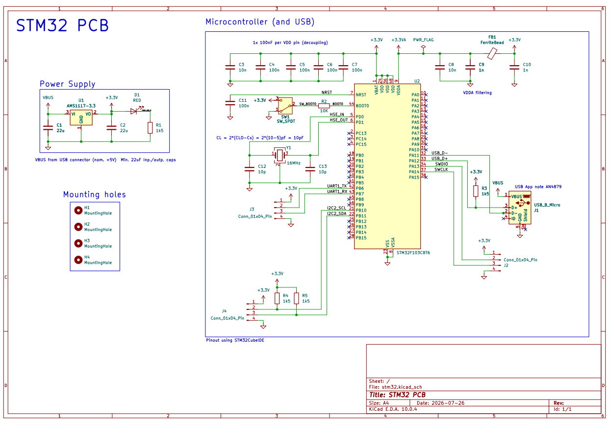
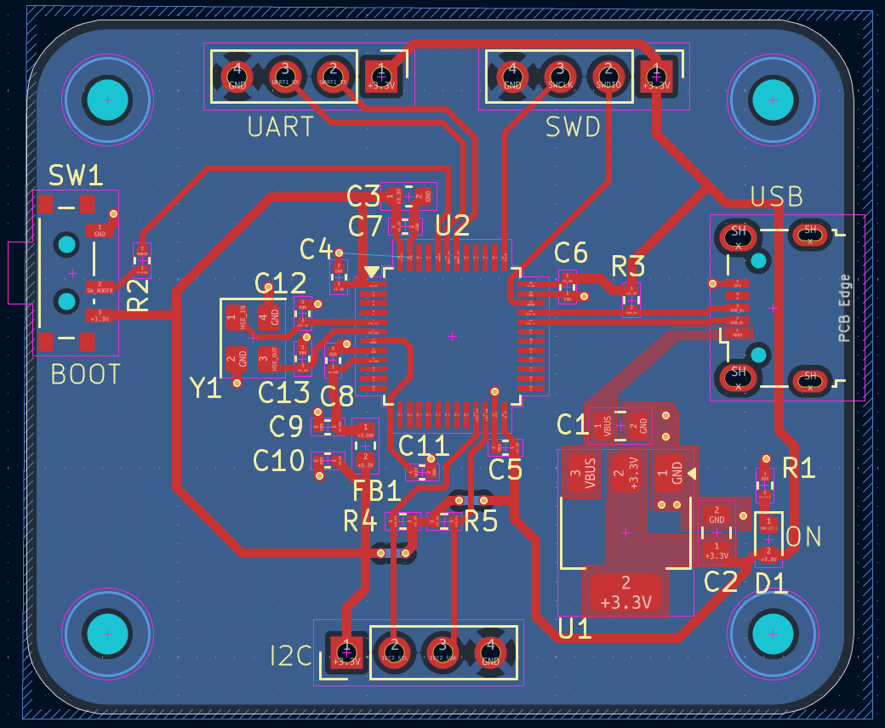
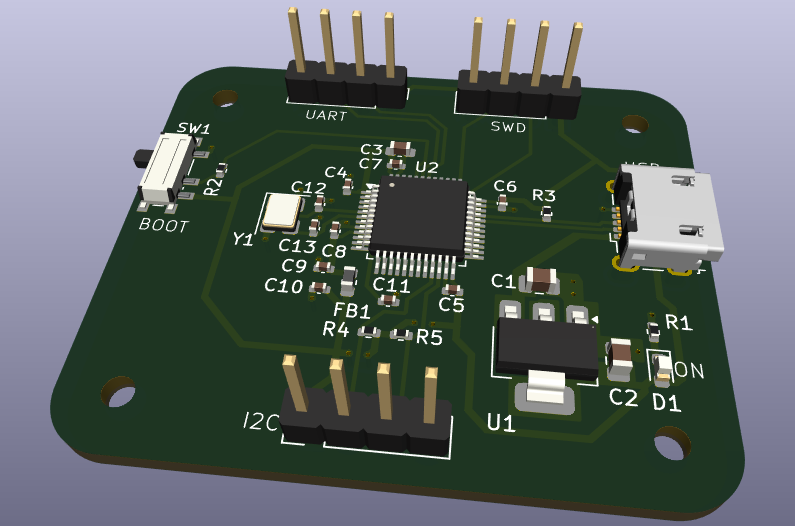

# STM32_PCB
PCB centered around the STM32F103C8T6 microcontroller developed in Kicad. This project taught me the main principles of schematic design, pinout planning with STM32CubeMX, power regulation using LDOs, and implementing hardware communication like I2C, UART, SWD, and USB.

**Schematic:**

**PCB:**

## Hardware Components

* **Microcontroller:** STM32F103C8T6.
* **Power:** Onboard 5V-to-3.3V LDO regulator with ferrite bead noise filtering.
* **Clock:** 16 MHz external crystal oscillator.
* **USB & Debug:** Micro-B USB  with standard 4-pin SWD programming pins.
* **Input/Output:** UART, I2C (with built-in pull-ups), and a BOOT0 switch.
